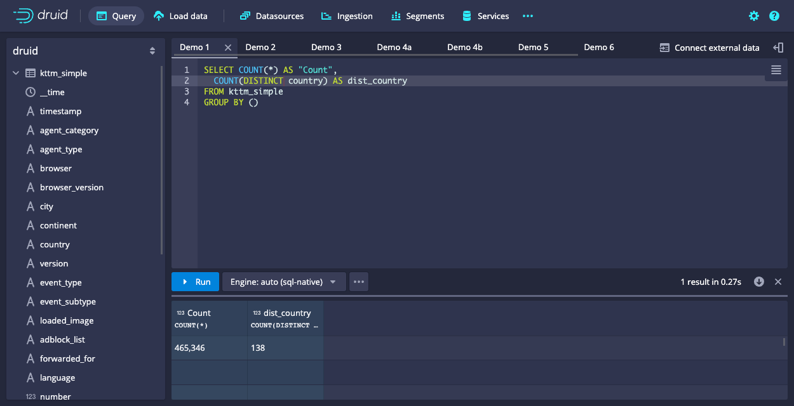
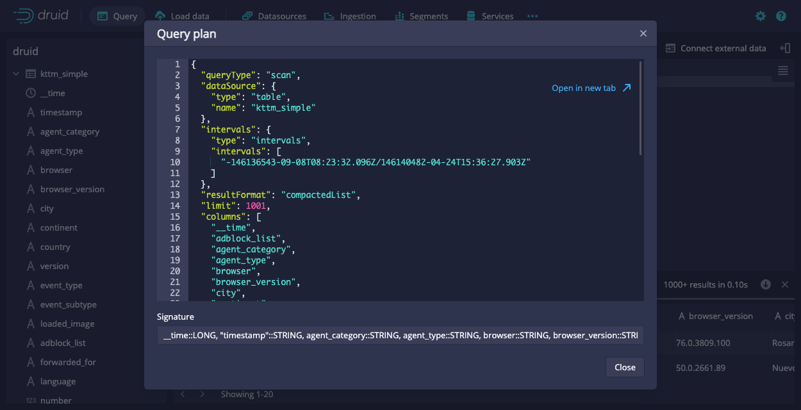

<!--
  ~ Licensed to the Apache Software Foundation (ASF) under one
  ~ or more contributor license agreements.  See the NOTICE file
  ~ distributed with this work for additional information
  ~ regarding copyright ownership.  The ASF licenses this file
  ~ to you under the Apache License, Version 2.0 (the
  ~ "License"); you may not use this file except in compliance
  ~ with the License.  You may obtain a copy of the License at
  ~
  ~   http://www.apache.org/licenses/LICENSE-2.0
  ~
  ~ Unless required by applicable law or agreed to in writing,
  ~ software distributed under the License is distributed on an
  ~ "AS IS" BASIS, WITHOUT WARRANTIES OR CONDITIONS OF ANY
  ~ KIND, either express or implied.  See the License for the
  ~ specific language governing permissions and limitations
  ~ under the License.
  -->

This tutorial demonstrates some useful features of the Query view in Apache Druid.

You can use the Query view to ingest and query data. You can also use it to test and tune queries before you use them in API requests&mdash;for example, to perform [SQL-based ingestion](../multi-stage-query/api.md).

The tutorial guides you through the steps to ingest sample data, and query the ingested data using some Query view features.

## Prerequisites

Before you follow the steps in this tutorial, download Druid as described in the [quickstart](./index.md) using the [micro-quickstart](../operations/single-server.md#micro-quickstart-4-cpu-16gib-ram) single-machine configuration and have it running on your local machine. You don't need to have loaded any data.

## Run a demo query to ingest data

In this section you load the demo queries that are included in Druid, and run a SQL task to ingest sample data into a datasource.

1. Navigate to the Druid console at [http://localhost:8888](http://localhost:8888) and click **Query**.

2. Click the ellipsis icon at the bottom of the query window and select **Load demo queries**. Note that loading the demo queries replaces all of your current query tabs. The demo queries load in several query tabs:

   

3. Click the **Demo 1** tab. This query ingests sample data into a datasource called **kttm_simple**. Click the **Demo 1** tab heading again and note the options&mdash;you can rename, copy and duplicate tabs.

4. Click **Run** to ingest the data.

5. When ingestion is complete, Druid displays the time it took to complete the insert query, and the new datasource **kttm_simple** displays in the left pane.

In this tutorial you only use the **Demo 1** query. You can explore the other tabs to see example queries that ingest, transform, and query sample data.

## View and filter query results

In this section you run some queries against the new datasource and perform some operations on the query results.

1. Click **+** to the right of the existing tabs to open a new query tab.

2. Click the name of the datasource **kttm_simple** in the left pane to display some automatically generated queries:

   

3. Click **SELECT * FROM kttm_simple** and run the query.

4. In the query results pane, click **Chrome** anywhere it appears in the **browser** column then click **Filter on: browser = 'Chrome'** to filter the results.

In this tutorial you only use the **Demo 1** query. You can explore the other tabs to see examples of queries that ingest, transform, and query sample data.

## Run aggregate queries

In this section you run some aggregate queries and perform some operations on the query results.

1. Open a new query tab.

2. Click **kttm_simple** in the left pane to display the generated queries.

3. Click **SELECT COUNT(*) AS "Count" FROM kttm_simple** and run the query.

4. After you run a query that contains an aggregate function, additional options become available in the Query view. 

   Click the arrow to the left of the **kttm_simple** datasource to display the columns, then click the **country** column. Several options appear to apply country-based filters and aggregate functions to the query:

   

5. Click **Aggregate > COUNT(DISTINCT country)** to add this clause to the query, then run the updated query:

   

6. Click **Engine: auto (sql-native)**. From the menu that appears you can edit the query context and turn off some query defaults. 

   Uncheck **Use approximate COUNT(DISTINCT)** and rerun the query. The country count in the results decreases because the computation has become more exact.

7. The Query view can provide information about a function, in case you aren't sure exactly what it does.

   Replace the query line `COUNT(DISTINCT country) AS dist_country` with `COUNT(DISTINCT)`. 
    A help dialog for the function displays:

   

   Click outside the help window to close it.

8. You can also perform actions on calculated columns in the results pane.

   Click the results column heading **dist_country COUNT(DISTINCT country)** to see the available options:

   

9. Select **Edit column** and change the **Output name** to **Distinct countries**.

## Generate an explain plan

In this section you generate an explain plan for a query. An explain plan shows the full query details and all of the operations Druid will perform to execute it.

1. Open a new query tab.

2. Click **kttm_simple** in the left pane to display the generated queries.

3. Click **SELECT * FROM kttm_simple** and run the query.

4. Click the ellipsis icon at the bottom of the query window and select **Explain SQL query**. The query plan opens in a new window:

   

5. Click **Open in new tab**. You can review the query details and modify it as required.

6. Change the limit from 1001 to 2001:
    `"Limit": 2001,`
    and run the query to confirm that 2,001 results are returned.

## Try out a few more features

In this section you try out a few more useful Query view features.

### Use calculator mode

Queries without a FROM clause run in calculator mode&mdash;this can be useful to help you understand how functions work.

1. Open a new query tab and enter the following:
   `SELECT SQRT(49)`

2. Run the query to produce the result `7`.

### Download query results

You can download query results in CSV, TSV, or newline-delimited JSON format.

1. Open a new query tab and run a query, for example:
    `SELECT DISTINCT platform from kttm_simple`

2. Above the results pane, click the down arrow and select **Download results as… CSV**. 

### View query history

In any query tab, click the ellipsis icon at the bottom of the query window and select **Query history**. 

You can click the links on the left to view queries run at a particular date and time, and open a previously run query in a new query tab.

## Further reading

For more information on ingestion and querying data, see the following topics:

- [Quickstart](./index.md) for information on getting started with Druid using the micro-quickstart configuration.
- [Tutorial: Querying data](tutorial-query.md) for example queries to run on Druid data.
- [Ingestion](../ingestion/index.md) for an overview of ingestion and the ingestion methods available in Druid.
- [SQL-based ingestion](../multi-stage-query/index.md) for an overview of SQL-based ingestion.
- [SQL-based ingestion query examples](../multi-stage-query/examples.md) for examples of SQL-based ingestion for various use cases.
